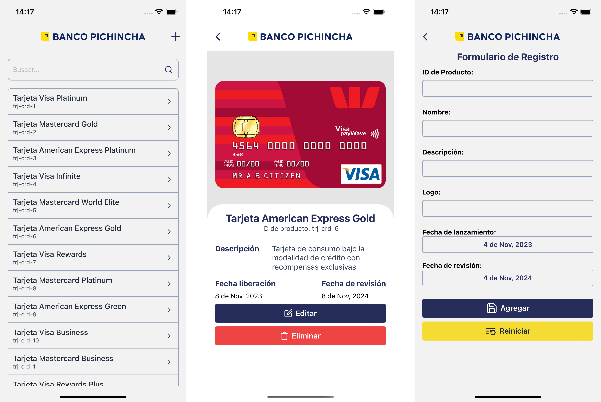

# BP Mobile - Devsu

Esta es una aplicación de gestión de productos financieros, parte del reto de técnico para desarrollador: Frontend - React Native.

## Funcionalidades

Según la descripción de la prueba, estas son las funcionalidades que se lograron implementar:

| Estado | Funcionalidad                          | Descripción                                                                                                                                                                                                                                                                                                                                      |
| ------ | -------------------------------------- | ------------------------------------------------------------------------------------------------------------------------------------------------------------------------------------------------------------------------------------------------------------------------------------------------------------------------------------------------ |
| ✅     | F1 - Listado de productos financieros  | Visualizar los productos financieros ofrecidos por Banco Pichincha desde una API. Maquetación basada en el diseño D1.                                                                                                                                                                                                                            |
| ✅     | F2 - Búsqueda de productos financieros | Realizar búsquedas de productos financieros mediante un campo de texto. Maquetación basada en el diseño D1.                                                                                                                                                                                                                                      |
| ✅     | F3 - Cantidad de registros             | Mostrar un listado de los registros obtenidos. Maquetación basada en el diseño D1.                                                                                                                                                                                                                                                               |
| ✅     | F4 - Agregar producto                  | Implementación de un botón "Agregar" para navegar al formulario de registro. El formulario debe permitir la creación de un producto a través del botón "Agregar" y permitir la limpieza del formulario mediante un botón de "Reiniciar". Maquetación del formulario basada en el diseño D2 y ubicación del botón principal en base al diseño D3. |
| ✅     | F5 - Editar producto                   | Botón que permite la edición del producto. Al hacer clic, se navega a la pantalla de edición manteniendo el campo de ID deshabilitado. El formulario de edición debe mantener las mismas validaciones de la funcionalidad F4 y mostrar errores por cada campo. Maquetación del formulario de edición basada en el diseño D2.                     |
| ✅     | F6 - Eliminar producto                 | Botón que al hacer clic muestra un modal con un botón de "Cancelar" y un botón "Eliminar". Al hacer clic en Eliminar, procede con la eliminación. En caso de cancelar, solo oculta el modal. Maquetación del modal basada en el diseño D4.                                                                                                       |

Pantallas principales de la aplicación:



Video:

[](./assets/video.mp4)

## Herramientas y Tecnologias utilizadas:

| Dependencia                       | Versión | Descripción                                                   |
| --------------------------------- | ------- | ------------------------------------------------------------- |
| @react-navigation/native          | 6.1.9   | Biblioteca de navegación para React Native.                   |
| @react-navigation/stack           | 6.3.20  | Stack navigator para React Navigation.                        |
| @shopify/flash-list               | 1.6.2   | Alternativa a FlatList para React Native.                     |
| apisauce                          | 3.0.1   | Cliente para consumir APIs en React Native.                   |
| formik                            | 2.4.5   | Biblioteca para manejar formularios en React Native.          |
| lucide-react-native               | 0.291.0 | Conjunto de iconos para React Native.                         |
| react                             | 18.2.0  | Biblioteca principal de React.                                |
| react-native                      | 0.72.6  | Infraestructura para construir aplicaciones móviles en React. |
| react-native-date-picker          | 4.3.3   | Selector de fecha para React Native.                          |
| react-native-image-viewing        | 0.2.2   | Visor de imágenes para React Native.                          |
| react-native-root-toast           | 3.5.1   | Muestra notificaciones tipo toast en React Native.            |
| react-native-skeleton-placeholder | 5.2.4   | Crea esqueletos de carga para componentes en React Native.    |
| react-native-splash-screen        | 3.3.0   | Pantalla de presentación para React Native.                   |
| yup                               | 1.3.2   | Biblioteca de validación de esquemas para JavaScript.         |
| typescript                        | 4.8.4   | Superset de JavaScript                                        |
| jest                              | 29.2.1  | Test Runner                                                   |

## Instalación

Para la instalación se requiere la versión 18.18.0 de NodeJs, Existe un archivo `.nvmrc` con la versión del proyecto, puede hacer uso de este con el comando `nvm use`.

Clonar el repositorio con el comando:

```bash
git clone https://github.com/arielscc/bp-mobile.git
```

Instalación de dependencias:

```bash
cd bp_mobile
yarn install
```

### iOS

Si es la primera vez que intenta ejecutar un proyecto Android con React Native es posible que necesite configuraciones adicionales, puede usar la documentación oficial para ello: https://reactnative.dev/docs/environment-setup?platform=ios

Instalacion de Pods

```bash
cd ios && pod install && cd -
```

Arrancar el proyecto

```bash
yarn ios
```

### Android

Si es la primera vez que intenta ejecutar un proyecto Android con React Native es posible que necesite configuraciones adicionales, puede usar la documentación oficial para ello: https://reactnative.dev/docs/environment-setup?platform=android

Caso contrario puede arrancar el proyecto directamente usando:

```bash
yarn android
```
